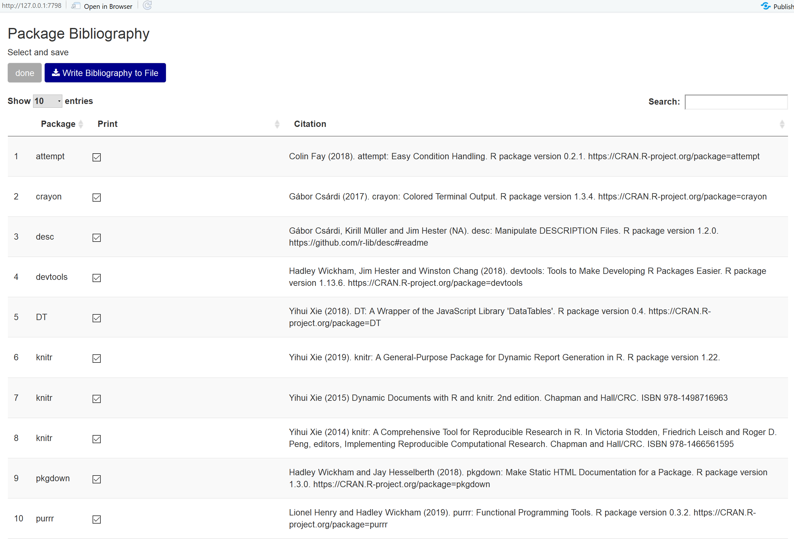

# lib2bib 

[](https://www.tidyverse.org/lifecycle/#experimental)
[](https://travis-ci.org/the-Hull/lib2bib)

The package `lib2bib` aims to facilitate acknowledging developers of (open-source) software in the #rstats community. 
Package development and maintenance require effort and time - most contributions are typically unpaid. 
Hence, some recognition goes a long way. 
`lib2bib` allows:
- identifying all packages used in a directory/project, script or `Rmarkdown` files, 
- printing them to console (or to a `list`)
- writing a `.txt` or `.bib` file with the package bibliography

An interactive app via `lib_interactive()` allows selecting packages for writing to a file.




## Installation

You can install an early development  version of `lib2bib` from [GitHub](https://github.com/the-hull/lib2bib) with:

``` r
remotes::install_github("lib2bib")
```

## Example

This is the simple workflow to get your package library going:

``` r

libs <- lib_find(path = ".", verbose = TRUE)
# as text
lib_print(libs, textformat = TRUE)
# as bibtex
lib_print(libs, textformat = FALSE)

# to write to a file either
lib_write(libs = libs, 
          "package.bib",
          append = FALSE, 
          textformat = TRUE)
# or
lib_interactive(libs = libs, textformat = FALSE)


```

